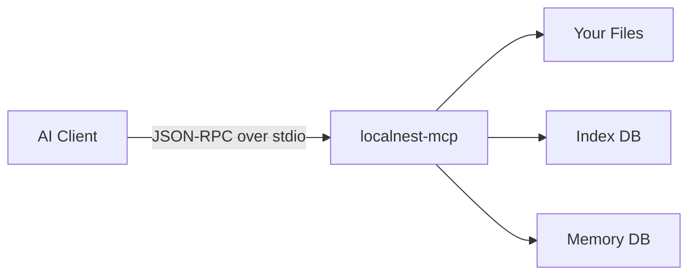
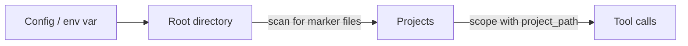
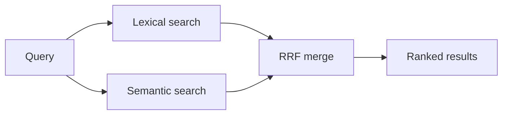
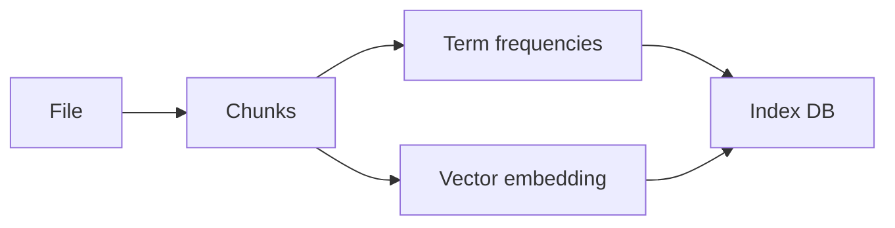
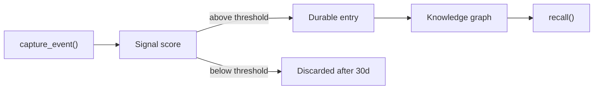
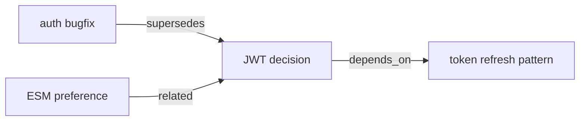
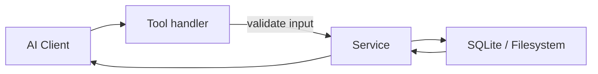

<!-- cspell:ignore localnest Xenova unref chunker LOCALNEST reranker ripgrep -->

# LocalNest MCP — Architecture

---

## What it is

An MCP server that gives AI clients safe, read-focused access to your local codebase and optional agent memory. Everything runs in-process over stdio — no HTTP, no cloud, no external service.



---

## How it boots

1. Read config from env vars and `localnest.config.json`
2. Build services (workspace, search, index, memory, updates)
3. Register 31 MCP tools across 4 groups
4. Start background monitors (staleness sweep + health checks)
5. Open stdio transport → ready

---

## The four tool groups

| Group | What it does | Key tools |
|-------|-------------|-----------|
| **Core** | Server status, health, self-update | `localnest_health`, `localnest_server_status` |
| **Retrieval** | Find and read files, search code | `localnest_search_hybrid`, `localnest_search_code`, `localnest_read_file` |
| **Memory Store** | Store and query durable agent knowledge | `localnest_memory_store`, `localnest_memory_recall` |
| **Memory Workflow** | High-level capture and recall for task context | `localnest_capture_outcome`, `localnest_task_context` |

---

## Workspace & project detection

You configure one or more root directories. LocalNest scans each root and auto-promotes any directory containing a known marker file (`package.json`, `go.mod`, `Cargo.toml`, etc.) into a named project. Tool calls can then be scoped to a single project via `project_path`.



---

## How search works

Hybrid search runs two signals in parallel and merges them.



- **Lexical** — fast exact matches, powered by ripgrep (JS fallback if missing)
- **Semantic** — local vector similarity via `Xenova/all-MiniLM-L6-v2` (384-dim, no GPU needed)
- **RRF** — Reciprocal Rank Fusion: combines both ranked lists into one score
- **Reranker** — optional cross-encoder pass for higher precision (off by default)

---

## How files get indexed

Files are split into overlapping chunks before they're stored and embedded.



Default chunk size is 60 lines with 15 lines of overlap. The chunker uses AST-aware splitting for supported languages, falling back to line-based for everything else.

---

## Index backend

| Backend | When used | Storage |
|---------|-----------|---------|
| `sqlite-vec` | Default (Node 22+) | Single `.db` file — BM25 + vector search |
| `json` | Fallback if sqlite-vec unavailable | Flat JSON index file |

Both backends expose the same tool surface. Switch via `LOCALNEST_INDEX_BACKEND`.

---

## How memory works

Events are scored on signal strength before being promoted to durable memory.



Signal score is based on event type, completion status, files changed, and content quality. Thresholds range from 2.25 (preferences/decisions) to 3.0 (general tasks).

---

## Memory knowledge graph

Entries can be linked with named relations, forming a traversable graph.



Use `localnest_memory_add_relation` to link entries. `localnest_memory_related` traverses one hop in either direction. `localnest_memory_suggest_relations` auto-suggests candidates using embedding similarity.

---

## How a tool call flows



Tool handlers validate input with Zod, delegate all logic to a service, and return plain JSON. No business logic lives inside handlers.

---

## Background monitors

Two timers run silently in the background and never block process exit.

**Staleness monitor** — checks if indexed files changed on disk; re-indexes automatically. Disabled by default in stdio mode.

**Health monitor** — runs every 30 minutes:
- WAL checkpoint if write-ahead log exceeds 32 MB
- SQLite integrity check on both DBs
- Prunes orphan chunks and stale term stats
- Prunes old memory events (30d ignored / 365d all)
- Caps revision history at 50 per memory entry

Results are exposed via `localnest_health → background_health`.

---

## Configuration quick reference

| Env var | Default | What it controls |
|---------|---------|-----------------|
| `PROJECT_ROOTS` | CWD | Semicolon-separated root paths (`label=path;...`) |
| `LOCALNEST_INDEX_BACKEND` | `sqlite-vec` | `sqlite-vec` or `json` |
| `LOCALNEST_VECTOR_CHUNK_LINES` | `60` | Lines per index chunk |
| `LOCALNEST_VECTOR_CHUNK_OVERLAP` | `15` | Overlap between chunks |
| `LOCALNEST_EMBED_MODEL` | `Xenova/all-MiniLM-L6-v2` | Embedding model |
| `LOCALNEST_MEMORY_ENABLED` | `false` | Enable memory subsystem |
| `LOCALNEST_HEALTH_MONITOR_INTERVAL_MINUTES` | `30` | Health monitor cadence (0 = off) |
| `LOCALNEST_INDEX_SWEEP_INTERVAL_MINUTES` | `0` | Staleness sweep cadence (0 = off) |

Full config reference: `src/runtime/config.js`.

---

## Source layout

```
src/
├── app/               # entry point, service factory, tool registration
├── mcp/
│   ├── common/        # health monitor, staleness monitor, schemas, status
│   └── tools/         # core · retrieval · memory-store · memory-workflow
├── services/
│   ├── retrieval/     # chunker · tokenizer · embedding · BM25 · search
│   ├── memory/        # schema · store · entries · events · recall · relations
│   ├── workspace/     # root detection, file reads, project tree
│   └── update/        # version check, self-update
└── runtime/           # config parsing, home layout, sqlite-vec detection
```

---

## Key decisions

**stdio only** — no HTTP server, no attack surface beyond the MCP protocol itself.

**Graceful degradation** — sqlite-vec missing → JSON fallback. ripgrep missing → JS fallback. Memory disabled → retrieval unaffected. Every optional subsystem fails independently.

**Local-first** — embeddings run via `@xenova/transformers` (WASM, no GPU needed). Nothing leaves the machine.

**Forward-only schema migrations** — `CREATE INDEX IF NOT EXISTS` and `ALTER TABLE ADD COLUMN` only. Existing databases are never dropped or rebuilt.

**Thin tool handlers** — handlers validate and delegate. All logic lives in services, keeping tool registration files readable at a glance.
