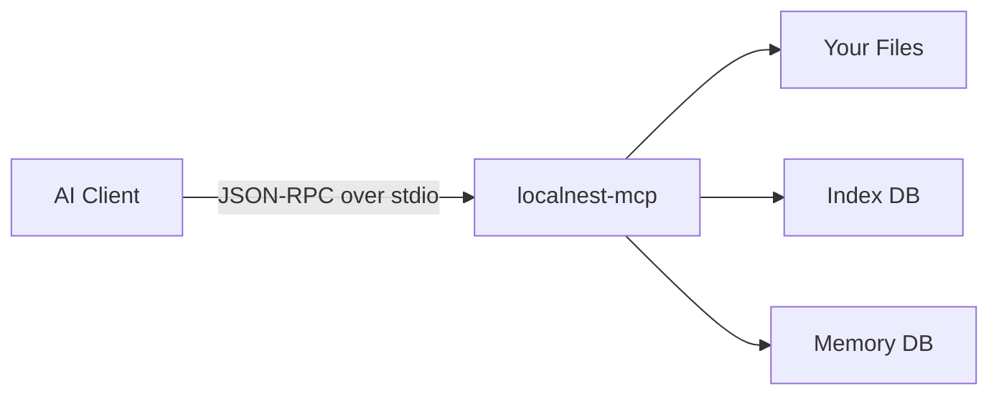
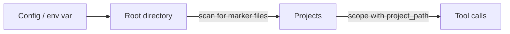
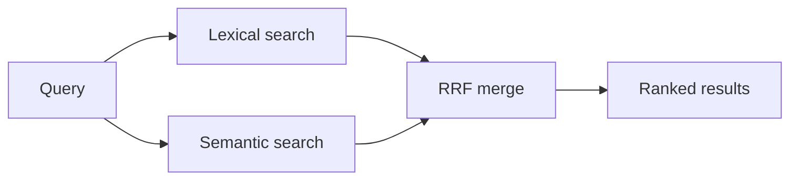
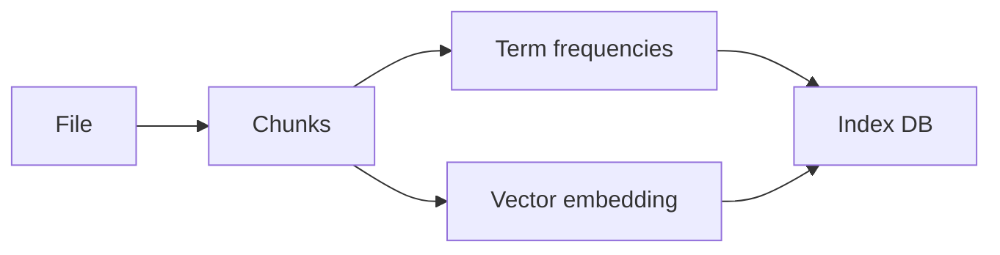
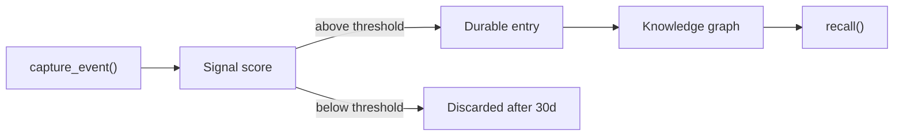
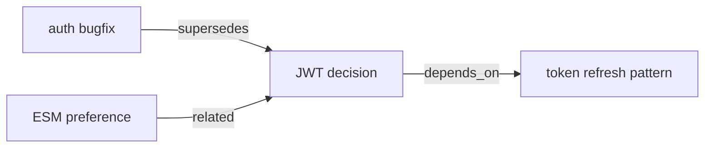
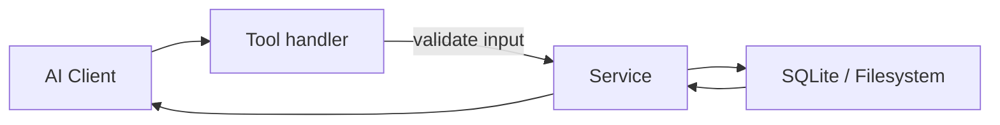

# Architecture

<div className="docPanel docPanel--compact">
  <p>
    Use this page when you need a systems view of LocalNest instead of task-by-task setup or tool
    reference guidance. It explains how the MCP server boots, how retrieval is fused, how indexing
    and memory are structured, and which runtime decisions shape the product.
  </p>
</div>

<div className="docGrid docGrid--3">
  <div className="docPanel">
    <span className="docEyebrow">Transport</span>
    <h3>stdio MCP server</h3>
    <p>All interaction happens over JSON-RPC on stdio. There is no HTTP server in the runtime path.</p>
  </div>
  <div className="docPanel">
    <span className="docEyebrow">Retrieval</span>
    <h3>Lexical + semantic</h3>
    <p>Exact search, semantic retrieval, and optional reranking are combined into one local-first workflow.</p>
  </div>
  <div className="docPanel">
    <span className="docEyebrow">State</span>
    <h3>Local memory + index</h3>
    <p>Index data and optional memory stay on disk on the user’s machine rather than leaving the environment.</p>
  </div>
</div>

## System shape



## Boot sequence

<div className="docSteps">
  <div className="docStep">
    <span>1</span>
    <div>
      <strong>Load runtime config</strong>
      <p>Environment variables and <code>localnest.config.json</code> are merged into one runtime config.</p>
    </div>
  </div>
  <div className="docStep">
    <span>2</span>
    <div>
      <strong>Build services</strong>
      <p>Workspace, retrieval, indexing, memory, and update services are constructed from the resolved config.</p>
    </div>
  </div>
  <div className="docStep">
    <span>3</span>
    <div>
      <strong>Register tools</strong>
      <p>MCP handlers are bound to the service layer with schema validation and response normalization.</p>
    </div>
  </div>
  <div className="docStep">
    <span>4</span>
    <div>
      <strong>Start monitors</strong>
      <p>Background staleness and health monitors are initialized without blocking the process exit path.</p>
    </div>
  </div>
  <div className="docStep">
    <span>5</span>
    <div>
      <strong>Open stdio transport</strong>
      <p>The MCP server begins serving requests to the connected AI client.</p>
    </div>
  </div>
</div>

## Tool groups

<div className="docGrid docGrid--2">
  <div className="docPanel">
    <h3>Core</h3>
    <p>Status, health, usage guidance, and self-update behavior.</p>
    <ul>
      <li><code>localnest_server_status</code></li>
      <li><code>localnest_health</code></li>
      <li><code>localnest_usage_guide</code></li>
      <li><code>localnest_update_self</code></li>
    </ul>
  </div>
  <div className="docPanel">
    <h3>Retrieval</h3>
    <p>File discovery, exact search, hybrid retrieval, and line-window verification.</p>
    <ul>
      <li><code>localnest_search_files</code></li>
      <li><code>localnest_search_code</code></li>
      <li><code>localnest_search_hybrid</code></li>
      <li><code>localnest_read_file</code></li>
    </ul>
  </div>
  <div className="docPanel">
    <h3>Memory Store</h3>
    <p>Durable project knowledge, memory recall, and relation management.</p>
    <ul>
      <li><code>localnest_memory_store</code></li>
      <li><code>localnest_memory_recall</code></li>
      <li><code>localnest_memory_related</code></li>
      <li><code>localnest_memory_add_relation</code></li>
    </ul>
  </div>
  <div className="docPanel">
    <h3>Memory Workflow</h3>
    <p>Higher-level task context and outcome capture for day-to-day agent work.</p>
    <ul>
      <li><code>localnest_task_context</code></li>
      <li><code>localnest_capture_outcome</code></li>
      <li><code>localnest_memory_capture_event</code></li>
    </ul>
  </div>
</div>

## Project detection

Configured roots are scanned for marker files such as <code>package.json</code>, <code>go.mod</code>, or <code>Cargo.toml</code>. Matching directories become named projects, and most tools can then be scoped with <code>project_path</code>.



## Retrieval pipeline

<div className="docPanel">
  <p>
    Hybrid retrieval runs lexical and semantic signals in parallel, then merges them with reciprocal
    rank fusion. Reranking is optional and used when callers want higher final precision.
  </p>
</div>



| Signal | Purpose | Notes |
| --- | --- | --- |
| Lexical | Exact identifiers, imports, errors, regex patterns | Uses ripgrep when available, with JS fallback |
| Semantic | Concept-level retrieval | Local embeddings, no external search service |
| Reranker | Final precision pass | Optional, kept off by default in many workflows |

## Indexing model

Files are split into overlapping chunks before term and embedding data is stored.



<div className="docGrid docGrid--2">
  <div className="docPanel">
    <h3>Chunking</h3>
    <p>Default chunk size is 60 lines with 15 lines of overlap.</p>
  </div>
  <div className="docPanel">
    <h3>Fallback behavior</h3>
    <p>Supported languages use AST-aware chunking; other files fall back to line-based chunking.</p>
  </div>
</div>

## Memory pipeline

Events are scored before they are promoted into durable memory.



Memories can also be linked into a graph with named relations.



## Request handling



Handlers validate with Zod and delegate the real behavior to services.

## Background runtime work

<div className="docGrid docGrid--2">
  <div className="docPanel">
    <h3>Staleness monitor</h3>
    <p>Checks whether indexed files changed on disk and refreshes state when configured to do so.</p>
  </div>
  <div className="docPanel">
    <h3>Health monitor</h3>
    <p>Runs integrity checks, pruning, and database maintenance tasks on a background cadence.</p>
  </div>
</div>

## Source layout

```text
src/
├── app/
├── mcp/
├── services/
├── runtime/
```

## Design decisions

<div className="docGrid docGrid--2">
  <div className="docPanel">
    <h3>stdio only</h3>
    <p>No HTTP server is exposed in the normal runtime path.</p>
  </div>
  <div className="docPanel">
    <h3>Graceful degradation</h3>
    <p>Missing optional subsystems should fall back instead of taking retrieval down with them.</p>
  </div>
  <div className="docPanel">
    <h3>Local-first execution</h3>
    <p>Embeddings, reranking, indexing, and memory stay on the local machine.</p>
  </div>
  <div className="docPanel">
    <h3>Thin handlers</h3>
    <p>Handlers validate and normalize; service modules own the business logic.</p>
  </div>
</div>
