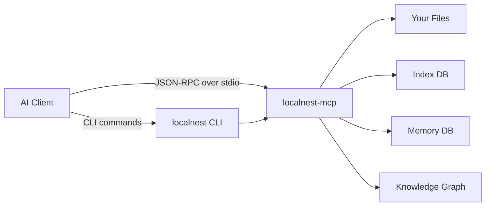
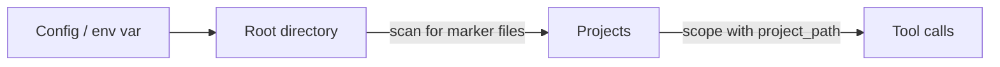
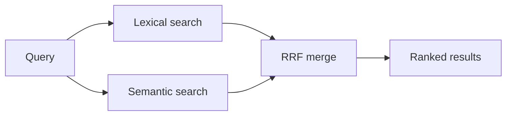
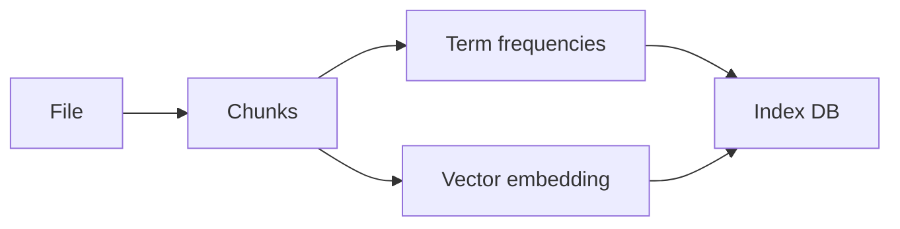
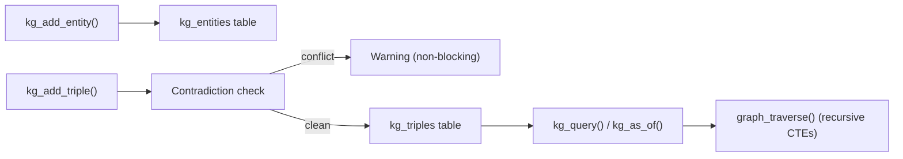
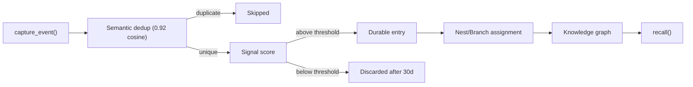
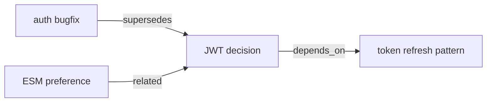
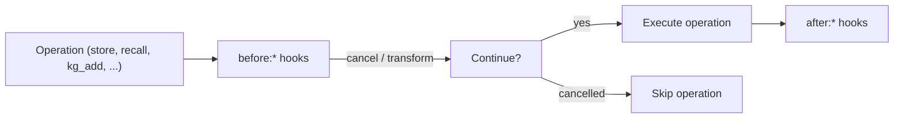
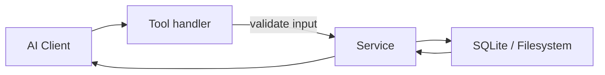

# Architecture

<div className="docPanel docPanel--compact">
  <p>
    Use this page when you need a systems view of LocalNest instead of task-by-task setup or tool
    reference guidance. It explains how the MCP server boots, how retrieval is fused, how indexing
    and memory are structured, how the knowledge graph and traversal work, and which runtime decisions shape the product.
  </p>
</div>

<div className="docGrid docGrid--3">
  <div className="docPanel">
    <span className="docEyebrow">Transport</span>
    <h3>stdio MCP server</h3>
    <p>All interaction happens over JSON-RPC on stdio. There is no HTTP server in the runtime path.</p>
  </div>
  <div className="docPanel">
    <span className="docEyebrow">Retrieval</span>
    <h3>Lexical + semantic</h3>
    <p>Exact search, semantic retrieval, and optional reranking are combined into one local-first workflow.</p>
  </div>
  <div className="docPanel">
    <span className="docEyebrow">State</span>
    <h3>Local memory + KG + index</h3>
    <p>Index data, optional memory, and knowledge graph stay on disk on the user's machine rather than leaving the environment.</p>
  </div>
</div>

## System shape



## Boot sequence

<div className="docSteps">
  <div className="docStep">
    <span>1</span>
    <div>
      <strong>Load runtime config</strong>
      <p>Environment variables and <code>localnest.config.json</code> are merged into one runtime config.</p>
    </div>
  </div>
  <div className="docStep">
    <span>2</span>
    <div>
      <strong>Run schema migrations</strong>
      <p>Per-version transaction wrapping upgrades SQLite schemas from v5 through v9 (KG entities, triples, agent diary, conversation sources) with rollback safety.</p>
    </div>
  </div>
  <div className="docStep">
    <span>3</span>
    <div>
      <strong>Build services</strong>
      <p>Workspace, retrieval, indexing, memory, knowledge graph, taxonomy, scopes, dedup, ingest, and hooks services are constructed from the resolved config.</p>
    </div>
  </div>
  <div className="docStep">
    <span>4</span>
    <div>
      <strong>Register tools</strong>
      <p>52 MCP handlers are bound to the service layer with schema validation and response normalization.</p>
    </div>
  </div>
  <div className="docStep">
    <span>5</span>
    <div>
      <strong>Start monitors</strong>
      <p>Background staleness and health monitors are initialized without blocking the process exit path.</p>
    </div>
  </div>
  <div className="docStep">
    <span>6</span>
    <div>
      <strong>Open stdio transport</strong>
      <p>The MCP server begins serving requests to the connected AI client.</p>
    </div>
  </div>
</div>

## Tool groups

<div className="docGrid docGrid--2">
  <div className="docPanel">
    <h3>Core</h3>
    <p>Status, health, usage guidance, and self-update behavior.</p>
    <ul>
      <li><code>localnest_server_status</code></li>
      <li><code>localnest_health</code></li>
      <li><code>localnest_usage_guide</code></li>
      <li><code>localnest_update_self</code></li>
    </ul>
  </div>
  <div className="docPanel">
    <h3>Retrieval</h3>
    <p>File discovery, exact search, hybrid retrieval, and line-window verification.</p>
    <ul>
      <li><code>localnest_search_files</code></li>
      <li><code>localnest_search_code</code></li>
      <li><code>localnest_search_hybrid</code></li>
      <li><code>localnest_read_file</code></li>
    </ul>
  </div>
  <div className="docPanel">
    <h3>Memory Store</h3>
    <p>Durable project knowledge, memory recall, and relation management.</p>
    <ul>
      <li><code>localnest_memory_store</code></li>
      <li><code>localnest_memory_recall</code></li>
      <li><code>localnest_memory_related</code></li>
      <li><code>localnest_memory_add_relation</code></li>
    </ul>
  </div>
  <div className="docPanel">
    <h3>Memory Workflow</h3>
    <p>Higher-level task context and outcome capture for day-to-day agent work.</p>
    <ul>
      <li><code>localnest_task_context</code></li>
      <li><code>localnest_capture_outcome</code></li>
      <li><code>localnest_memory_capture_event</code></li>
    </ul>
  </div>
  <div className="docPanel">
    <h3>Knowledge Graph</h3>
    <p>Temporal entity-triple store with point-in-time queries and contradiction detection.</p>
    <ul>
      <li><code>localnest_kg_add_entity</code></li>
      <li><code>localnest_kg_add_triple</code></li>
      <li><code>localnest_kg_query</code></li>
      <li><code>localnest_kg_invalidate</code></li>
      <li><code>localnest_kg_as_of</code></li>
      <li><code>localnest_kg_timeline</code></li>
      <li><code>localnest_kg_stats</code></li>
    </ul>
  </div>
  <div className="docPanel">
    <h3>Nest/Branch + Traversal</h3>
    <p>Two-level memory taxonomy and multi-hop graph walking.</p>
    <ul>
      <li><code>localnest_nest_list</code></li>
      <li><code>localnest_nest_branches</code></li>
      <li><code>localnest_nest_tree</code></li>
      <li><code>localnest_graph_traverse</code></li>
      <li><code>localnest_graph_bridges</code></li>
    </ul>
  </div>
  <div className="docPanel">
    <h3>Agent Diary</h3>
    <p>Per-agent private scratchpad with scoped isolation.</p>
    <ul>
      <li><code>localnest_diary_write</code></li>
      <li><code>localnest_diary_read</code></li>
    </ul>
  </div>
  <div className="docPanel">
    <h3>Ingestion + Dedup + Hooks</h3>
    <p>Conversation import, duplicate detection, and operation callbacks.</p>
    <ul>
      <li><code>localnest_ingest_markdown</code></li>
      <li><code>localnest_ingest_json</code></li>
      <li><code>localnest_memory_check_duplicate</code></li>
      <li><code>localnest_hooks_stats</code></li>
      <li><code>localnest_hooks_list_events</code></li>
    </ul>
  </div>
</div>

## Project detection

Configured roots are scanned for marker files such as <code>package.json</code>, <code>go.mod</code>, or <code>Cargo.toml</code>. Matching directories become named projects, and most tools can then be scoped with <code>project_path</code>.



## Retrieval pipeline

<div className="docPanel">
  <p>
    Hybrid retrieval runs lexical and semantic signals in parallel, then merges them with reciprocal
    rank fusion. Reranking is optional and used when callers want higher final precision.
  </p>
</div>



| Signal | Purpose | Notes |
| --- | --- | --- |
| Lexical | Exact identifiers, imports, errors, regex patterns | Uses ripgrep when available, with JS fallback |
| Semantic | Concept-level retrieval | Local embeddings, no external search service |
| Reranker | Final precision pass | Optional, kept off by default in many workflows |

## Indexing model

Files are split into overlapping chunks before term and embedding data is stored.



<div className="docGrid docGrid--2">
  <div className="docPanel">
    <h3>Chunking</h3>
    <p>Default chunk size is 60 lines with 15 lines of overlap.</p>
  </div>
  <div className="docPanel">
    <h3>Fallback behavior</h3>
    <p>Supported languages use AST-aware chunking; other files fall back to line-based chunking.</p>
  </div>
</div>

## Knowledge graph pipeline

The temporal knowledge graph stores structured facts as subject-predicate-object triples with time validity.



<div className="docGrid docGrid--2">
  <div className="docPanel">
    <h3>Temporal validity</h3>
    <p>Every triple carries <code>valid_from</code> and <code>valid_to</code> timestamps. Point-in-time queries via <code>kg_as_of</code> return what was true at any given date.</p>
  </div>
  <div className="docPanel">
    <h3>Multi-hop traversal</h3>
    <p>Recursive CTEs walk relationships 1-5 hops deep with cycle prevention. <code>graph_bridges</code> discovers cross-nest connections.</p>
  </div>
  <div className="docPanel">
    <h3>Contradiction detection</h3>
    <p>At write time, new triples are checked against existing valid triples on the same subject+predicate. Conflicts are flagged as warnings without blocking the write.</p>
  </div>
  <div className="docPanel">
    <h3>Entity auto-creation</h3>
    <p>Entities are auto-created on first triple reference with normalized slug IDs. Provenance is tracked via <code>source_memory_id</code>.</p>
  </div>
</div>

## Memory pipeline

Events are scored before they are promoted into durable memory.



Memories can also be linked into a graph with named relations.



<div className="docGrid docGrid--2">
  <div className="docPanel">
    <h3>Nest/Branch hierarchy</h3>
    <p>Two-level taxonomy: nests are top-level domains, branches are topics within nests. Metadata-filtered recall narrows candidates before scoring.</p>
  </div>
  <div className="docPanel">
    <h3>Semantic dedup</h3>
    <p>Every write passes through an embedding similarity gate (default 0.92 cosine threshold). Near-duplicates are caught before storage.</p>
  </div>
  <div className="docPanel">
    <h3>Agent isolation</h3>
    <p>Each agent gets its own memory scope and private diary via the <code>agent_id</code> column (schema v8). Recall returns own + global memories, never another agent's private data.</p>
  </div>
  <div className="docPanel">
    <h3>Conversation ingestion</h3>
    <p>Markdown/JSON chat exports are parsed into per-turn memory entries with automatic entity extraction and KG triple creation. Re-ingestion is prevented by content hash.</p>
  </div>
</div>

## Hooks system



<div className="docGrid docGrid--2">
  <div className="docPanel">
    <h3>Hook types</h3>
    <p>Pre-hooks can cancel or transform payloads. Post-hooks run after completion. Wildcards (<code>before:&#42;</code>, <code>after:&#42;</code>) catch all events.</p>
  </div>
  <div className="docPanel">
    <h3>Introspection</h3>
    <p><code>localnest_hooks_stats</code> reports registered hook counts. <code>localnest_hooks_list_events</code> shows available hook event names.</p>
  </div>
</div>

## Request handling



Handlers validate with Zod and delegate the real behavior to services.

## Background runtime work

<div className="docGrid docGrid--2">
  <div className="docPanel">
    <h3>Staleness monitor</h3>
    <p>Checks whether indexed files changed on disk and refreshes state when configured to do so.</p>
  </div>
  <div className="docPanel">
    <h3>Health monitor</h3>
    <p>Runs integrity checks, pruning, and database maintenance tasks on a background cadence.</p>
  </div>
</div>

## Source layout

```text
src/
├── app/                          # Application bootstrap
├── mcp/
│   └── tools/
│       └── graph-tools.js        # MCP registration for KG, traversal, diary, ingest, hooks
├── services/
│   ├── memory/
│   │   ├── kg.js                 # Knowledge graph entity and triple CRUD
│   │   ├── graph.js              # Recursive CTE traversal and bridge discovery
│   │   ├── taxonomy.js           # Nest/branch hierarchy helpers
│   │   ├── scopes.js             # Agent diary CRUD and scope isolation
│   │   ├── dedup.js              # Embedding similarity gate
│   │   ├── ingest.js             # Conversation parsing and ingestion pipeline
│   │   └── hooks.js              # Pre/post operation hook system
│   └── ...                       # Existing retrieval, indexing, workspace services
├── cli/
│   ├── options.js                # Global CLI flag parser
│   ├── help.js                   # Colored help renderer
│   ├── router.js                 # Noun-verb subcommand dispatcher
│   └── commands/
│       ├── memory.js             # Memory CLI (add, search, list, show, delete)
│       ├── kg.js                 # Knowledge Graph CLI (add, query, timeline, stats)
│       ├── skill.js              # Skill management CLI (install, list, remove)
│       ├── mcp.js                # MCP lifecycle CLI (start, status, config)
│       ├── ingest.js             # Conversation ingestion CLI
│       └── completion.js         # Shell completion generators (bash, zsh, fish)
├── runtime/
```

## Design decisions

<div className="docGrid docGrid--2">
  <div className="docPanel">
    <h3>stdio only</h3>
    <p>No HTTP server is exposed in the normal runtime path.</p>
  </div>
  <div className="docPanel">
    <h3>Graceful degradation</h3>
    <p>Missing optional subsystems should fall back instead of taking retrieval down with them.</p>
  </div>
  <div className="docPanel">
    <h3>Local-first execution</h3>
    <p>Embeddings, reranking, indexing, memory, and knowledge graph stay on the local machine.</p>
  </div>
  <div className="docPanel">
    <h3>Thin handlers</h3>
    <p>Handlers validate and normalize; service modules own the business logic.</p>
  </div>
  <div className="docPanel">
    <h3>SQLite for everything</h3>
    <p>Index, memory, knowledge graph, and agent diary all use SQLite. Zero external database dependencies.</p>
  </div>
  <div className="docPanel">
    <h3>Additive migrations</h3>
    <p>Schema versions v5 through v9 are all additive and backward-compatible. Per-version transaction wrapping ensures safe rollback on failure.</p>
  </div>
</div>
