<!-- cspell:ignore localnest Xenova HuggingFace huggingface unref chunker LOCALNEST reranker ripgrep -->

# LocalNest MCP — Architecture

---

## What it is

A TypeScript MCP server that gives AI clients safe, read-focused access to your local codebase and agent memory with a full knowledge graph. Everything runs in-process over stdio — no HTTP, no cloud, no external service.

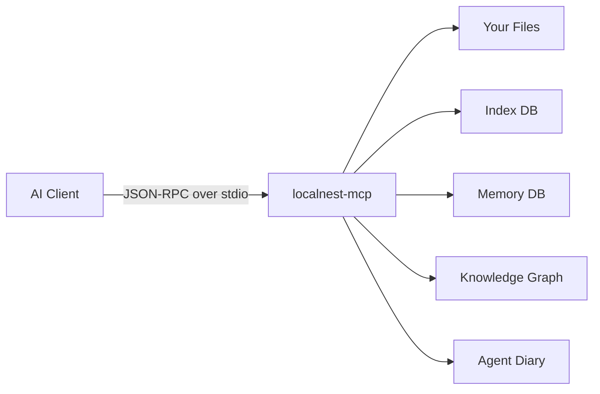

---

## How it boots

1. Read config from env vars and `localnest.config.json`
2. Build services (workspace, search, index, memory, updates)
3. Run forward-only schema migrations (v1 → v9)
4. Initialize hooks system (`MemoryHooks` instance on the store)
5. Register 72 MCP tools across 8 groups
6. Start background monitors (staleness sweep + health checks)
7. Open stdio transport → ready

---

## Tool groups

| Group | What it does | Key tools |
|-------|-------------|-----------|
| **Core** | Server status, health, self-update | `localnest_health`, `localnest_server_status` |
| **Retrieval** | Find and read files, search code | `localnest_search_hybrid`, `localnest_search_code`, `localnest_read_file` |
| **Memory Store** | Store and query durable agent knowledge | `localnest_memory_store`, `localnest_memory_recall` |
| **Memory Workflow** | High-level capture and recall for task context | `localnest_capture_outcome`, `localnest_task_context` |
| **Knowledge Graph** | Entities, triples, temporal queries | `localnest_kg_add_entity`, `localnest_kg_add_triple`, `localnest_kg_query`, `localnest_kg_as_of`, `localnest_kg_timeline`, `localnest_kg_stats` |
| **Graph Traversal** | Multi-hop traversal, cross-nest bridges | `localnest_graph_traverse`, `localnest_graph_bridges` |
| **Taxonomy** | Nest/branch hierarchy browsing | `localnest_nest_list`, `localnest_nest_branches`, `localnest_nest_tree` |
| **Agent Diary** | Per-agent isolated scratch notes | `localnest_diary_write`, `localnest_diary_read` |
| **Ingestion** | Conversation import pipelines | `localnest_ingest_markdown`, `localnest_ingest_json` |
| **Dedup** | Semantic duplicate detection | `localnest_memory_check_duplicate` |
| **Hooks** | Hook introspection | `localnest_hooks_stats`, `localnest_hooks_list_events` |

---

## Workspace & project detection

You configure one or more root directories. LocalNest scans each root and auto-promotes any directory containing a known marker file (`package.json`, `go.mod`, `Cargo.toml`, etc.) into a named project. Tool calls can then be scoped to a single project via `project_path`.

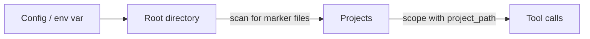

---

## How search works

Hybrid search runs two signals in parallel and merges them.

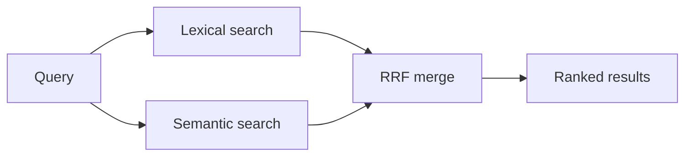

- **Lexical** — fast exact matches, powered by ripgrep (TS fallback if missing)
- **Semantic** — local vector similarity via `Xenova/all-MiniLM-L6-v2` (384-dim, no GPU needed)
- **RRF** — Reciprocal Rank Fusion: combines both ranked lists into one score
- **Reranker** — optional cross-encoder pass for higher precision (off by default)

---

## How files get indexed

Files are split into overlapping chunks before they're stored and embedded.

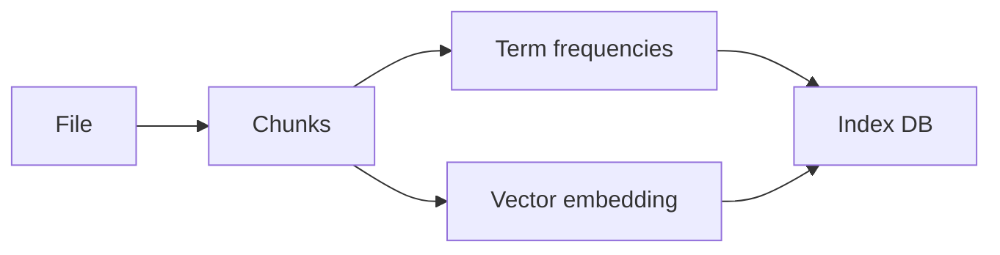

Default chunk size is 60 lines with 15 lines of overlap. The chunker uses AST-aware splitting for supported languages, falling back to line-based for everything else.

---

## Index backend

| Backend | When used | Storage |
|---------|-----------|---------|
| `sqlite-vec` | Default (Node 22+) | Single `.db` file — BM25 + vector search |
| `json` | Fallback if sqlite-vec unavailable | Flat JSON index file |

Both backends expose the same tool surface. Switch via `LOCALNEST_INDEX_BACKEND`.

---

## How memory works

Events are scored on signal strength before being promoted to durable memory.

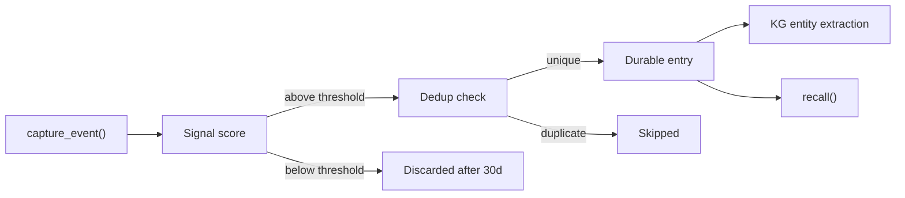

Signal score is based on event type, completion status, files changed, and content quality. Thresholds range from 2.25 (preferences/decisions) to 3.0 (general tasks).

Entries flow through several connected subsystems: **dedup** checks for semantic duplicates before storing, **taxonomy** organizes entries by nest/branch, **agent scoping** isolates per-agent data, and the **knowledge graph** extracts entities and triples from stored content.

---

## Knowledge Graph subsystem

The knowledge graph (KG) is a first-class subsystem built on two tables — `kg_entities` and `kg_triples` — managed by `knowledge-graph/kg.ts` and `knowledge-graph/graph.ts`.

### Entity-Triple model (`knowledge-graph/kg.ts`)

Entities are named nodes with a slugified ID, a type (`concept`, `file`, `url`, etc.), an optional JSON properties bag, and an optional link back to a `memory_entries` row via `memory_id`.

Triples are directed edges: `(subject_id, predicate, object_id)` with optional temporal bounds (`valid_from`, `valid_to`), a confidence score (0-1), and provenance fields (`source_memory_id`, `source_type`).

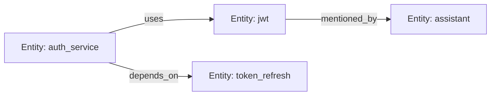

Key operations:

| Function | What it does |
|----------|-------------|
| `addEntity()` | Insert-or-ignore an entity, update `updated_at` on collision |
| `ensureEntity()` | Same as addEntity but minimal — used internally by `addTriple` |
| `addTriple()` | Insert a triple in a transaction; auto-creates missing entities from names; detects contradictions (same subject + predicate, different object, still valid) and returns them as warnings |
| `invalidateTriple()` | Sets `valid_to` on a triple without deleting it — supports temporal queries |
| `queryEntityRelationships()` | Outgoing, incoming, or both triples for an entity |
| `queryTriplesAsOf()` | Point-in-time query: returns only triples valid at a given date |
| `getEntityTimeline()` | Full chronological history of all triples (including invalidated) |
| `getKgStats()` | Aggregate counts: entities, total triples, active triples, breakdown by predicate |

### Graph traversal (`knowledge-graph/graph.ts`)

Deep traversal uses SQLite recursive CTEs with cycle prevention (path-based substring check).

| Function | What it does |
|----------|-------------|
| `traverseGraph()` | Walk the KG from a starting entity up to N hops (1-5, default 2). Direction: outgoing, incoming, or both. Returns each discovered entity with depth and full path. |
| `discoverBridges()` | Find triples where the subject and object belong to different nests. Joins through `memory_entries` to compare nest values. Useful for surfacing cross-domain connections. |

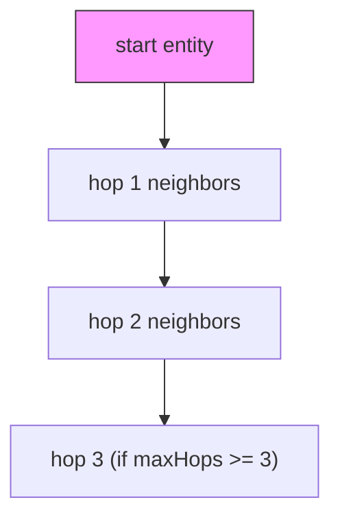

### Relationship to legacy relations

The older `memory_relations` table (`knowledge-graph/relations.ts`) still exists for simple bidirectional links between memory entries. The KG subsystem is the successor — it adds entity typing, predicates, temporal validity, confidence, provenance, and multi-hop traversal.

---

## Nest/Branch taxonomy

Memory entries are organized into a two-level hierarchy managed by `taxonomy/taxonomy.ts`:

- **Nest** — top-level domain or workspace (e.g. `project-alpha`, `devops`)
- **Branch** — sub-topic within a nest (e.g. `auth`, `ci-pipeline`)

Both are plain text columns on `memory_entries`, indexed together (`idx_memory_entries_nest_branch`).

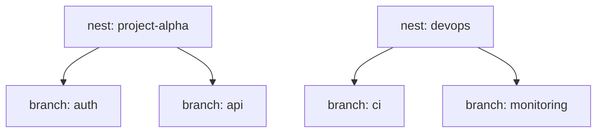

| Function | What it does |
|----------|-------------|
| `listNests()` | Aggregate active entries grouped by nest with counts |
| `listBranches(nest)` | List branches within a specific nest with counts |
| `getTaxonomyTree()` | Full tree: all nests, each with their branches and counts; totals for nests, branches, and memories |

Taxonomy values are set at store time via the `nest` and `branch` fields on `localnest_memory_store`. The MCP tools `localnest_nest_list`, `localnest_nest_branches`, and `localnest_nest_tree` expose the taxonomy read-side.

---

## Agent isolation (`taxonomy/scopes.ts`)

The agent diary provides private scratch space per agent. Each diary entry has an `agent_id`, `content`, optional `topic`, and a timestamp. Entries are stored in the `agent_diary` table and indexed by `(agent_id, created_at DESC)`.

Isolation is enforced at the query level — reads always filter by `agent_id`, so one agent cannot see another's diary.

| Function | What it does |
|----------|-------------|
| `writeDiaryEntry()` | Insert a diary entry scoped to `agent_id` |
| `readDiaryEntries()` | Paginated read of an agent's own diary, optionally filtered by topic |

Memory entries also carry an `agent_id` column (added in schema v8). When set, recalls and searches can filter by agent, providing soft scoping on shared memory.

---

## Semantic dedup (`store/dedup.ts`)

Before storing a new memory entry, the system can check for semantic duplicates using embedding cosine similarity.

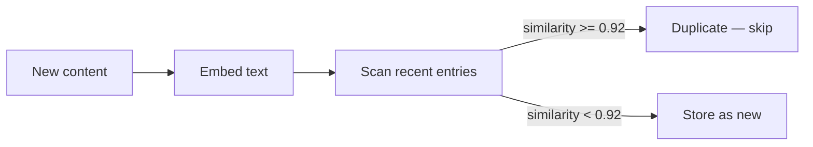

| Parameter | Default | Description |
|-----------|---------|-------------|
| `threshold` | 0.92 | Cosine similarity cutoff (0-1) |
| `nest` | - | Filter candidates to a specific nest |
| `branch` | - | Filter candidates to a specific branch |
| `projectPath` | - | Filter candidates to a specific project |

The check scans up to 200 most-recently-updated entries that have embeddings, computes cosine similarity against each, and returns the best match above threshold. If the embedding service is unavailable, dedup is silently skipped (no false rejections).

---

## Conversation ingestion pipeline (`ingest/ingest.ts`)

Ingestion converts conversation exports (Markdown or JSON) into memory entries and KG triples in a single pipeline.

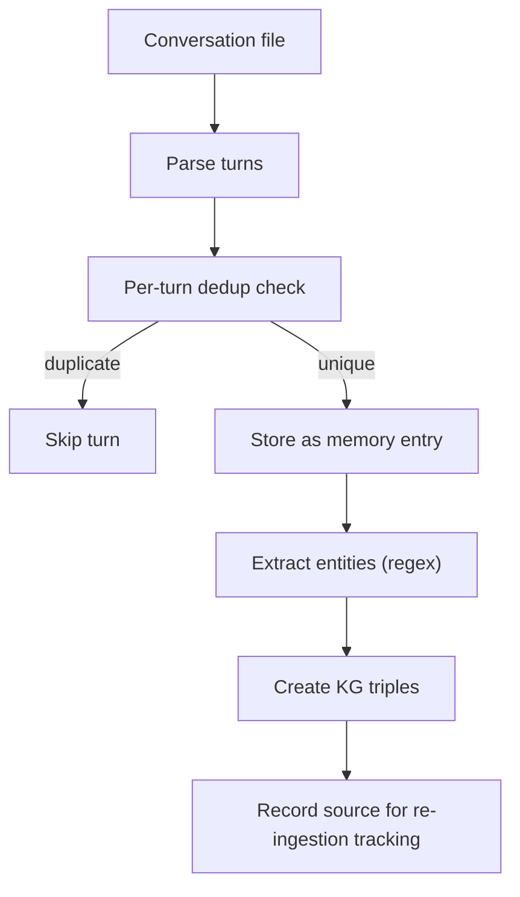

### Supported formats

**Markdown** — recognizes three role-marker patterns:
- `## User` / `## Assistant` (heading style)
- `**User:**` (bold-colon style)
- `User:` (plain prefix)

**JSON** — array of `{role, content, timestamp?}` objects.

### Entity extraction

Rule-based regex heuristics extract entities from turn content:

| Pattern | Type | Example |
|---------|------|---------|
| Capitalized multi-word phrases | concept | "Knowledge Graph", "Machine Learning" |
| Quoted terms | concept | "entity extraction" |
| File paths | file | `src/services/memory/knowledge-graph/kg.ts` |
| URLs | url | `https://example.com` |
| ALL_CAPS identifiers | concept | `SCHEMA_VERSION` |

Common English stop words are filtered out. Extraction is capped at 50 entities per turn.

### Triple generation

For each turn's entities:
- Each entity gets a `mentioned_by` triple linking it to the turn's role
- Co-occurring entities (up to 10) get `co_occurs_with` triples linking each pair

### Re-ingestion tracking

The `conversation_sources` table records `(file_path, file_hash)` for each ingested file. If the same file with the same SHA-256 hash is ingested again, the pipeline returns `skipped: already_ingested` immediately.

---

## Hooks system (`hooks.ts`)

The `MemoryHooks` class provides a pub-sub mechanism for memory and KG operations. External consumers (AI clients, plugins, automation) can register pre/post callbacks.

### Event lifecycle

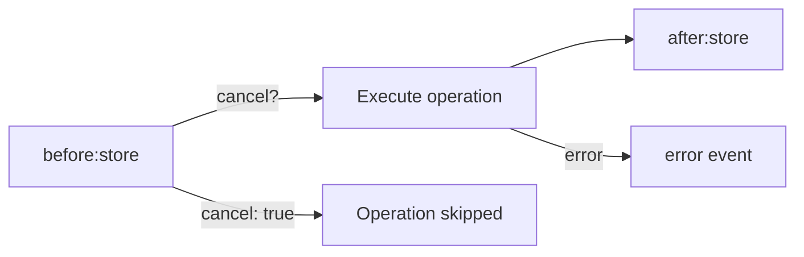

### Valid events

| Category | Events |
|----------|--------|
| Memory lifecycle | `before:store`, `after:store`, `before:update`, `after:update`, `before:delete`, `after:delete`, `before:recall`, `after:recall` |
| Knowledge graph | `before:kg:addEntity`, `after:kg:addEntity`, `before:kg:addTriple`, `after:kg:addTriple`, `before:kg:invalidate`, `after:kg:invalidate` |
| Graph traversal | `before:graph:traverse`, `after:graph:traverse`, `before:graph:bridges`, `after:graph:bridges` |
| Agent diary | `before:diary:write`, `after:diary:write` |
| Ingestion | `before:ingest`, `after:ingest` |
| Dedup | `before:dedup`, `after:dedup` |
| Taxonomy | `before:nest:list`, `after:nest:list` |
| Wildcards | `before:*`, `after:*` (catch-all) |
| Errors | `error` |

### Hook behavior

- **before:** listeners can return `{ cancel: true }` to abort the operation, or `{ payload: modified }` to transform input
- **after:** listeners receive the result; cannot cancel
- **error:** listeners in error handlers are swallowed to prevent infinite loops
- `on()` returns a `{ remove }` handle; `once()` auto-removes after first call
- `setEnabled(false)` globally disables all hooks without unregistering them

---

## CLI architecture

The CLI (`src/cli/`) provides a `localnest` command with noun-verb subcommands and legacy flat commands.

### Module layout

```
src/cli/
├── help.ts          # Colored help renderer (raw ANSI, NO_COLOR/FORCE_COLOR aware)
├── options.ts       # Global flag parser (--json, --verbose, --quiet, --config)
├── router.ts        # Noun-verb routing + legacy fallback
└── commands/
    ├── memory.ts    # memory add|search|list|show|delete
    ├── kg.ts        # kg add|query|timeline|stats
    ├── skill.ts     # skill install|list|remove
    ├── mcp.ts       # mcp start|status|config
    ├── ingest.ts    # ingest <file>
    └── completion.ts # Shell completion generation
```

### Routing (`router.ts`)

The router uses two maps:

1. **NOUN_MODULES** — maps nouns (`memory`, `kg`, `skill`, `mcp`, `ingest`, `completion`) to handler modules. Each handler exports `run(args, opts)`.
2. **LEGACY_MODULES** — maps flat commands (`setup`, `doctor`, `upgrade`, `task-context`, `capture-outcome`) to standalone scripts for backward compatibility.

When `routeCommand(command, rest, globalOpts, binMetaUrl)` is called:
1. Check if `command` is a known noun → dynamic-import handler, call `run(rest, opts)`
2. Check if `command` is a legacy flat command → rewrite `process.argv` and import the script
3. Return `false` if unknown

### Service bootstrap pattern

Each command module follows the same pattern:
1. Import `buildRuntimeConfig()` from `src/runtime/config.ts`
2. Create an `EmbeddingService` from runtime config
3. Create a `MemoryService` passing runtime config + embedding service
4. Call service methods, format output as human-readable or `--json`

### Output modes

All commands support `--json` for machine-readable output. Human output uses table formatting with padding/truncation helpers. The help renderer uses raw ANSI codes with `NO_COLOR` / `FORCE_COLOR` environment variable support.

---

## Schema evolution (v5 → v9)

The memory database uses forward-only migrations. Each migration runs in a transaction and bumps `schema_version` in `memory_meta`. Current version: **9**.

| Version | What it adds |
|---------|-------------|
| **v5** | Composite indexes on `(scope_project_path, status, importance)` and `(kind, status)` for faster filtered queries |
| **v6** | `kg_entities` table (id, name, entity_type, properties_json, memory_id) and `kg_triples` table (subject_id, predicate, object_id, valid_from, valid_to, confidence, source_memory_id, source_type) with indexes on type, memory, subject, object, predicate, validity, and source |
| **v7** | `nest` and `branch` columns on `memory_entries` with composite index for taxonomy |
| **v8** | `agent_id` column on `memory_entries` with index; `agent_diary` table (id, agent_id, content, topic, created_at) with `(agent_id, created_at)` index |
| **v9** | `conversation_sources` table (id, file_path, file_hash, turn_count, memory_ids_json, ingested_at) with unique index on `(file_path, file_hash)` for re-ingestion tracking |

All migrations use `ALTER TABLE ADD COLUMN` (with try/catch for idempotency) and `CREATE TABLE IF NOT EXISTS`. Existing data is never dropped or rebuilt.

---

## How a tool call flows

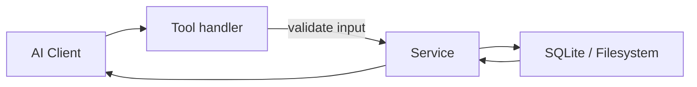

Tool handlers validate input with Zod, delegate all logic to a service, and return plain JSON. No business logic lives inside handlers.

---

## Background monitors

Two timers run silently in the background and never block process exit.

**Staleness monitor** — checks if indexed files changed on disk; re-indexes automatically. Disabled by default in stdio mode.

**Health monitor** — runs every 30 minutes:
- WAL checkpoint if write-ahead log exceeds 32 MB
- SQLite integrity check on both DBs
- Prunes orphan chunks and stale term stats
- Prunes old memory events (30d ignored / 365d all)
- Caps revision history at 50 per memory entry

Results are exposed via `localnest_health → background_health`.

---

## Configuration quick reference

| Env var | Default | What it controls |
|---------|---------|-----------------|
| `PROJECT_ROOTS` | CWD | Semicolon-separated root paths (`label=path;...`) |
| `LOCALNEST_INDEX_BACKEND` | `sqlite-vec` | `sqlite-vec` or `json` |
| `LOCALNEST_VECTOR_CHUNK_LINES` | `60` | Lines per index chunk |
| `LOCALNEST_VECTOR_CHUNK_OVERLAP` | `15` | Overlap between chunks |
| `LOCALNEST_EMBED_MODEL` | `Xenova/all-MiniLM-L6-v2` | Embedding model |
| `LOCALNEST_MEMORY_ENABLED` | `false` | Enable memory subsystem |
| `LOCALNEST_HEALTH_MONITOR_INTERVAL_MINUTES` | `30` | Health monitor cadence (0 = off) |
| `LOCALNEST_INDEX_SWEEP_INTERVAL_MINUTES` | `0` | Staleness sweep cadence (0 = off) |

Full config reference: `src/runtime/config.ts`.

---

## Source layout

```
src/
├── app/               # entry point, service factory, tool registration
├── cli/
│   ├── help.ts        # colored help renderer
│   ├── options.ts     # global flag parser
│   ├── router.ts      # noun-verb + legacy command routing
│   └── commands/      # memory · kg · skill · mcp · ingest · completion
├── mcp/
│   ├── common/        # health monitor, staleness monitor, schemas, status
│   └── tools/         # core · retrieval · memory-store · memory-workflow · graph-tools
├── services/
│   ├── retrieval/     # chunker · tokenizer · embedding · BM25 · search
│   ├── memory/
│   │   ├── schema.ts        # table DDL + forward-only migrations (v1-v9)
│   │   ├── store.ts         # MemoryStore facade — wires all modules together
│   │   ├── service.ts       # MemoryService — backend detection, public API
│   │   ├── hooks.ts         # MemoryHooks pub-sub system
│   │   ├── workflow.ts      # high-level workflow helpers
│   │   ├── adapter.ts       # SQLite adapter abstraction
│   │   ├── utils.ts         # shared helpers (nowIso, cleanString, stableJson)
│   │   ├── events/
│   │   │   ├── capture.ts   # event capture + signal scoring
│   │   │   ├── heuristics.ts # signal score computation
│   │   │   └── list.ts      # event listing
│   │   ├── ingest/
│   │   │   └── ingest.ts    # conversation ingestion (markdown + JSON)
│   │   ├── knowledge-graph/
│   │   │   ├── graph.ts     # recursive CTE traversal + bridge discovery
│   │   │   ├── kg.ts        # knowledge graph entities + triples
│   │   │   └── relations.ts # legacy bidirectional relations
│   │   ├── store/
│   │   │   ├── dedup.ts     # semantic duplicate detection via cosine similarity
│   │   │   ├── entries.ts   # CRUD for memory_entries
│   │   │   └── recall.ts    # recall queries with filtering and ranking
│   │   └── taxonomy/
│   │       ├── scopes.ts    # agent diary + agent-scoped isolation
│   │       └── taxonomy.ts  # nest/branch hierarchy queries
│   ├── workspace/     # root detection, file reads, project tree
│   └── update/        # version check, self-update
└── runtime/           # config parsing, home layout, sqlite-vec detection
```

---

## Key decisions

**stdio only** — no HTTP server, no attack surface beyond the MCP protocol itself.

**Graceful degradation** — sqlite-vec missing → JSON fallback. ripgrep missing → TypeScript fallback. Memory disabled → retrieval unaffected. Embeddings unavailable → dedup silently skipped. Every optional subsystem fails independently.

**Local-first** — embeddings and reranking run via `@huggingface/transformers` with local ONNX/WASM runtime support. Nothing leaves the machine.

**Forward-only schema migrations** — `CREATE INDEX IF NOT EXISTS` and `ALTER TABLE ADD COLUMN` only. Existing databases are never dropped or rebuilt. Migration version tracked in `memory_meta`.

**Thin tool handlers** — handlers validate and delegate. All logic lives in services, keeping tool registration files readable at a glance.

**Temporal knowledge graph** — triples carry `valid_from`/`valid_to` bounds so facts can be invalidated without deletion. Point-in-time queries reconstruct state at any date.

**Agent isolation by convention** — diary entries and agent-scoped memory entries use `agent_id` as a query filter. No row-level security — isolation is enforced at the service layer.

**Hooks as extension point** — `MemoryHooks` provides before/after interception on all memory and KG operations without modifying core logic. Before-hooks can cancel or transform payloads.
